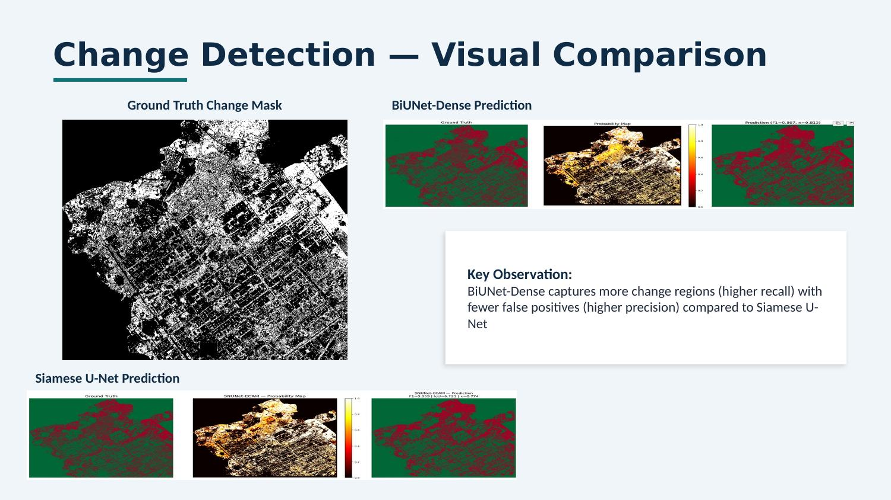

# Urban Change Detection from Satellite Imagery

**Benchmarking deep learning architectures for Land Use / Land Cover (LULC) change detection using 3-meter PlanetScope satellite imagery over Indian cities.**



## Overview

Rapid urbanization in Indian cities demands scalable, accurate monitoring of land-use changes. This project benchmarks deep learning architectures for binary change detection on bi-temporal satellite imagery (2016 → 2025) over **Chandigarh** — a planned grid city undergoing rapid peripheral expansion — using 3-meter PlanetScope RGB imagery from ISRO.

Both models are trained with identical data splits, augmentation, and loss functions for a fair head-to-head comparison. A third architecture (SiamUNet-diff) is implemented and available in the codebase for future benchmarking.

## Results

| Model | F1-Score | IoU | Kappa | OA | Precision | Recall |
|-------|----------|-----|-------|-----|-----------|--------|
| **BiUNet-Dense** | **0.8673** | **0.7657** | **0.8129** | **92.25%** | 0.8129 | 0.9296 |
| SNUNet-ECAM | 0.8390 | 0.7226 | 0.7737 | 90.68% | 0.7930 | 0.8907 |

> BiUNet-Dense outperforms SNUNet-ECAM across all metrics. Its bilateral dense connections between T1 and T2 encoders allow direct feature exchange, catching subtle changes that the Siamese weight-sharing approach misses. ~3,370 hectares (31.2% of the study area) underwent land cover change between 2016 and 2025.

## Architecture Comparison

| Feature | BiUNet-Dense | SNUNet-ECAM | SiamUNet-diff |
|---------|-------------|-------------|---------------|
| Input format | Concatenated [T1 \| T2] | Separate T1, T2 | Separate T1, T2 |
| Encoder | Standard U-Net | Shared Siamese + Nested | Shared Siamese |
| Skip connections | Direct | Dense (UNet++) | Feature differencing |
| Attention | None | Ensemble Channel Attention | None |
| Status | ✅ Benchmarked | ✅ Benchmarked | 🔧 Implemented |
| Reference | — | Fang et al., IEEE GRSL 2021 | Daudt et al., IEEE ICIP 2018 |

## Project Structure

```
├── configs/
│   └── default.yaml          # All hyperparameters in one place
├── src/
│   ├── models/
│   │   ├── biunet.py          # Bi-temporal U-Net
│   │   ├── snunet_ecam.py     # Siamese Nested UNet + ECAM
│   │   └── siamunet_diff.py   # Siamese UNet with feature differencing
│   ├── data/
│   │   ├── dataset.py         # PyTorch datasets (concat & siamese)
│   │   └── utils.py           # GeoTIFF I/O, patch extraction
│   ├── losses.py              # BCE + Dice combined loss
│   └── metrics.py             # F1, IoU, Kappa, OA tracker
├── train.py                   # Train any model from CLI
├── evaluate.py                # Full-scene inference + metrics + plots
├── notebooks/                 # Original Colab experiments
├── data/                      # Satellite imagery (not in repo — see data/README.md)
└── results/figures/           # Output plots and change maps
```

## Quick Start

### 1. Clone and install

```bash
git clone https://github.com/Shubhi-Agarwal0612/lulc-change-detection.git
cd lulc-change-detection
pip install -r requirements.txt
```

### 2. Add your data

Place satellite imagery in `data/` (see [`data/README.md`](data/README.md) for details).

### 3. Train a model

```bash
# Train SNUNet-ECAM (default)
python train.py --config configs/default.yaml

# Train BiUNet
python train.py --config configs/default.yaml --model biunet

# Train SiamUNet-diff with custom settings
python train.py --config configs/default.yaml --model siamunet-diff --epochs 50 --batch-size 4
```

### 4. Evaluate and generate change maps

```bash
python evaluate.py --config configs/default.yaml --checkpoint outputs/best_snunet_ecam.pth
```

This produces a geo-referenced change probability map, a binary prediction map, and a side-by-side comparison plot.

## Technical Details

**Data pipeline:** Images are patchified into 256×256 tiles with 128-pixel stride. Train/test patches are split *spatially* (east–west) rather than randomly to prevent spatial autocorrelation leakage — a common pitfall in remote sensing ML.

**Training:** BCE + Dice combined loss with automatic positive-class weighting based on change pixel ratio. AdamW optimizer with cosine annealing schedule. Data augmentation includes random flips, 90° rotations, and brightness jitter.

**Inference:** Overlapping sliding window with averaged predictions eliminates tiling artifacts. Output maps preserve the original CRS (UTM 43N) for direct use in GIS software.

## Limitations & Future Work

- **Binary change only** — does not classify *what* changed (building, vegetation, water). Multi-class LULC transition mapping is a natural extension.
- **Single study area** — currently evaluated on Chandigarh; extending to Varanasi (organic city layout) would test generalization across contrasting urban morphologies.
- **ChangeFormer** — transformer-based architecture to complete a CNN vs. Transformer comparison. Planned for next phase.
- **SiamUNet-diff benchmarking** — architecture is implemented in `src/models/siamunet_diff.py` and runnable via `--model siamunet-diff`; formal evaluation pending.
- **NIR band integration** — PlanetScope provides a 4th near-infrared band that could improve vegetation discrimination.
- **Multi-temporal analysis** — adding intermediate years (2018, 2020, 2022) for trajectory-based change modeling.

## Acknowledgments

- Satellite imagery provided by **ISRO** via PlanetScope.
- Research conducted at **IEEE GRSS Student Branch, Manipal University Jaipur** under the guidance of **Dr. Yadvendra Pratap Singh**.
- SNUNet-ECAM architecture based on [Fang et al. (2021)](https://doi.org/10.1109/LGRS.2021.3056416).
- SiamUNet-diff architecture based on [Daudt et al. (2018)](https://doi.org/10.1109/ICIP.2018.8451652).

## License

[MIT](LICENSE)
